This is a Neo/Forge port of FoxyNoTail's [Create: Storage](https://www.curseforge.com/minecraft/mc-mods/create-storage)
addon from his second Create YouTube series, with some minor
tweaks and enhancements.

Check the CHANGELOG for the list of changes.

---

This mod features a handful of Storage Boxes, each with different sized inventories as well as a handful of new
upgradable backpacks.

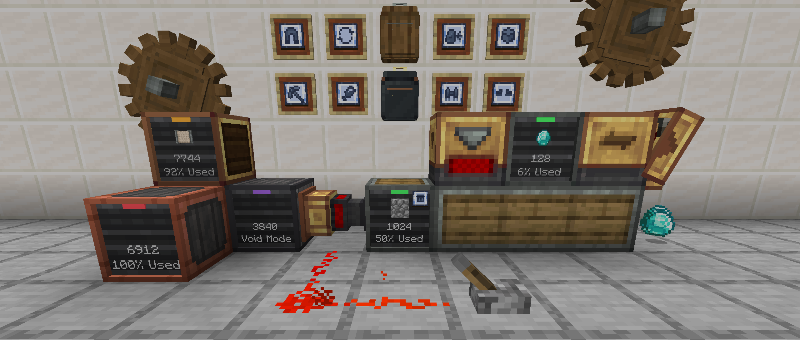

---

# Storage Boxes

### Description

**Storage Boxes** and **Simple Storage Boxes** are containers designed for compact, filterable item storage. Each
**Storage Box** variant offers different storage capacities and visual styles, whereas the **Simple Storage Boxes** offer
large single item storage with high capacity upgrades available.
Designed to integrate seamlessly into mechanical and logistical systems within the Create Mod, they provide a clean and
functional way to manage large amounts of items.

## Storage Box

- Cardboard, Industrial/Weathered Iron, Andesite, Copper, Brass, and Hardened variants available
- Each has a Create filter slot to filter which items can be inserted or extracted from
- Features a display on the front of each box showing item counts and how full the storage is
- An indicator light to show if the box is full, empty or has void mode enabled
- **Storage Boxes** can be interacted with by the player to add items without having to open the GUI
- GUI can be opened by interacting with an empty hand while sneaking

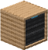
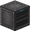
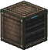
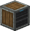
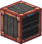
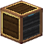
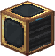

## Simple Storage Box

- Common wood variants (all have same attributes)
- Stores up to 2048 items by default (one item type only)
- GUI can be opened by interacting with an empty hand while sneaking
- **Item Filter**:
    - Automatically set when items are added
    - Remove filter by interacting with a **Wrench** (only when box is empty)
- **Upgrades**:
    - *Void Upgrade:* Automatically voids (deletes) excess items
        - Use: Interact with front display with upgrade in hand or add/remove via the GUI
    - *Capacity Upgrade:* Doubles current capacity, up to 9 times
        - Use: Add/remove via the GUI

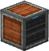
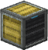
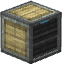
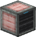
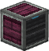
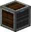

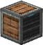
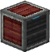
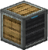

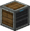
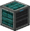

*Note: Maximum base capacity is 32x max stack size of item.*  
*Examples: Oak Logs = 2048, Ender Pearls = 512, Water Bucket = 32*

---

# Simple Storage Network

### Description

Links multiple **Simple Storage Boxes** together into a single network, allowing players and automation to access and
manage all stored items from a central (or multiple) point.
Simple storage networks are formed by connecting **Simple Storage Boxes** to a **Storage Controller** using **Storage
Trim** blocks, which act as conduits.
Once connected, the **Storage Controller** aggregates all items from the attached boxes, enabling insertion and
extraction through a single interface.

Additional components, like the **Storage Interface**, can be used to interact with the network through automation (
hoppers, chutes, funnels, etc.)

## Storage Trim

- Connects Simple Storage Boxes with **Storage Controller** and **Storage Interface** blocks
- Connected textures matching the Simple Storage Box variants

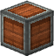
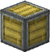
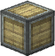
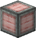
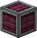
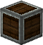

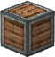
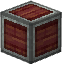
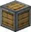
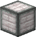
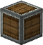
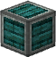

## Storage Controller

- Serves as the central input/output hub for a storage network
- Connects to **Simple Storage Boxes** using **Storage Trim**
- Indicator light illuminates once linked to at least one **Simple Storage Box**
- Supports both manual interaction and automation (e.g. hoppers, chutes, funnels)

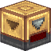

## Storage Interface

- Similar to the **Storage Controller** except:
    - Cannot be used directly by players for inserting or extracting items
    - Does not initiate or form a storage network on its own (requires a **Storage Controller**)
    - Designed exclusively for automated input/output (e.g. hoppers, chutes, funnels)

---

# Backpacks

### Description

Backpacks are wearable storage items that come in several material variants—each offering different storage capacities
and upgrade slots. Designed to integrate seamlessly with automation systems, backpacks feature multiple compartments,
including a main inventory for bulk items, a tool compartment for valuable gear, and dedicated upgrade slots. With
modular upgrades like magnetism, item refill, feeding, tool swapping, and even flight, backpacks offer utility far
beyond basic item storage, making them versatile companions for adventuring, building, or automation-focused gameplay.

## Backpack

- Industrial Iron, Andesite, Copper, Brass, and Hardened Backpacks
- Each backpack can hold up to six upgrades which affect how the backpack works when worn
- Different variations of the backpack stores different amounts of items per slot
- Storage is divided into 3 storage compartments:
    - **Main Storage:** Primary storage area where items can be interacted with by hoppers, chutes, funnels, etc.
    - **Tool Storage:** Secure compartment for your tools or precious items (cannot be interacted with by automation)
    - **Upgrade Slots:** Stores backpack upgrades; enable/disable with [Ctrl] + Right-Click

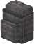
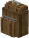
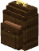
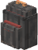
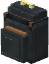

## Backpack Upgrades

| Item                                                                                     | Name                       | Description                                                                                                                        |
|------------------------------------------------------------------------------------------|----------------------------|------------------------------------------------------------------------------------------------------------------------------------|
|                | **Magnet Upgrade**         | Pulls items into the backpack's main storage compartment from up to 5 blocks away                                                  |
|        | **Item Pickup Upgrade**    | Transfers items directly into backpack's main storage instead of player inventory                                                  | 
|          | **Pick Block Upgrade**     | Pick block items directly from your backpack                                                                                       |
|                | **Refill Upgrade**         | Refills the player's main/off-hand item from the backpack if they are available                                                    |
|            | **Tool Swap Upgrade**      | Swaps out any tool held in the player's main hand for the best available tool or weapon when mining a block or attacking an entity |
|                | **Feeder Upgrade**         | Automatically feeds the player food from the backpack when the player is hungry enough to eat                                      |
|                | **Flight Upgrade**         | Turns any Backpack into a jetpack with hovering abilities (uses Create backtanks for fuel)                                         |
|              | **Fall Damage Upgrade**    | Prevents the player from taking fall damage while wearing the backpack                                                             |
|          | **Ore Mining Upgrade**     | Mines entire clusters of matching ore blocks, dropping the loot near the player                                                    |
|  | **Torch Deployer Upgrade** | Automatically places a torch from the backpack when the surrounding light level is low                                           |

---

# Passer Blocks

### Description

Passer Blocks are utility blocks that are used to transfer items between adjacent containers. They operate in a similar
way
to hoppers, moving one item at a time, however they do not have any internal inventory. Smart Passer blocks expand on
the
Passer by enabling items to be filtered and transferring up to 64 items at once.

## Basic Passer

- Moves items directly between containers, including vanilla storage blocks
- Transfers items in the direction it faces (can be rotated with a Create Wrench)
- Moves one item at a time, similar to a hopper
- Does not have internal storage—items pass straight through instantly

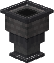

## Smart Passer

- Inherits all features of the Basic Passer
- Supports item filtering using a Create filter
- Transfer amount is configurable via the value panel (click and hold the filter slot to adjust)
- Will halt item transfer when powered by a redstone signal

