<h1 align="center">Create: Storage</h1>

  <b>Storage that feels like part of Create</b> 
  Tiered Storage Boxes, bulk storage networks, upgradeable backpacks, and smart item Passers

  
  
  
  
  

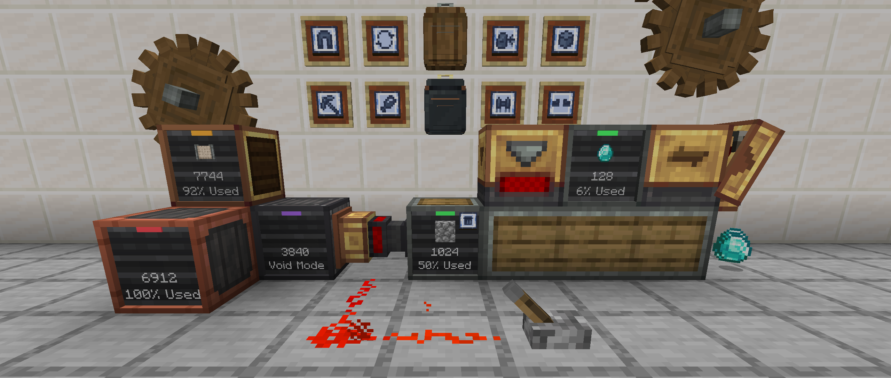

**Create: Storage** adds storage blocks and backpacks built to work alongside Create's machines, with Create's look,
filters, wrenches, goggles and Ponder scenes. Feed a production line, bank a farm's entire output, or carry a workshop
on your back.

---

  <a href="#storage-boxes"><b>Storage Boxes</b></a> ·
  <a href="#simple-storage-network"><b>Simple Storage Network</b></a> ·
  <a href="#backpacks"><b>Backpacks</b></a> ·
  <a href="#passer-blocks"><b>Passer Blocks</b></a> ·
  <a href="#compatibility"><b>Compatibility</b></a> ·
  <a href="#modpack-developers"><b>Modpack Developers</b></a>

---

# Storage Boxes

### Description

**Storage Boxes** and **Simple Storage Boxes** are containers designed for compact, filterable item storage. Each
**Storage Box** variant offers different storage capacities and visual styles, whereas the **Simple Storage Boxes**
offer
large single item storage with high capacity upgrades available. Designed to integrate seamlessly into mechanical
and logistical systems within the Create Mod, they provide a clean and functional way to manage large amounts of items.

## Storage Box

- Cardboard, Industrial/Weathered Iron, Andesite, Copper, Brass, and Hardened variants available
- Each has a Create filter slot to filter which items can be inserted or extracted from
- Features a display on the front of each box showing item counts and how full the storage is
- An indicator light to show if the box is full, empty or has void mode enabled
- **Storage Boxes** can be interacted with by the player to add items without having to open the GUI
- GUI can be opened by interacting with an empty hand while sneaking

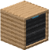
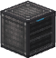
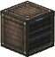
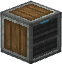
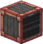
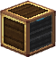
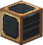

## Simple Storage Box

- Common wood variants (all have same attributes)
- Stores up to 2048 items by default (one item type only)
- GUI can be opened by interacting with an empty hand while sneaking
- **Item Filter**:
    - Automatically set when items are added
    - Remove filter by interacting with a **Wrench** (only when box is empty)
- **Upgrades**:
    - *Void Upgrade:* Automatically voids (deletes) excess items
        - Use: Interact with front display with upgrade in hand or add/remove via the GUI
    - *Capacity Upgrade:* Doubles current capacity, up to 9 times
        - Use: Add/remove via the GUI

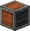
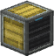
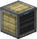
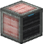
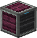
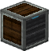

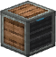
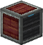
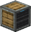

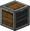
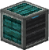

*Note: Maximum base capacity is 32x max stack size of item.*  
*Examples: Oak Logs = 2048, Ender Pearls = 512, Water Bucket = 32*

## Reserve Barrel

The **Reserve Barrel** is a storage block that always keeps a minimum stock of selected items. Automation can only take
the surplus above that minimum, which makes it ideal for self-sustaining farms: a tree farm can keep the saplings it
needs for replanting while all the extra logs and saplings flow on to the rest of your storage.

- 27 storage slots, plus up to 9 **reserved items** set in the top row of the menu, each with a minimum amount to keep
- **Players** and **Deployers** can always take items, so Deployers on a farm contraption can keep replanting
- Status bar on the front shows the state of each reserve
- Interact with items in hand to insert them, with an empty hand while sneaking to open the GUI, or with a **Wrench** to
  toggle void mode

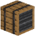

---

# Simple Storage Network

### Description

Links multiple **Simple Storage Boxes** together into a single network, allowing players and automation to access and
manage all stored items from a central (or multiple) point. Simple storage networks are formed by connecting **Simple
Storage Boxes** to a **Storage Controller** using **Storage Trim** blocks, which act as conduits. Once connected, the
**Storage Controller** aggregates all items from the attached boxes, enabling insertion and extraction through a
single interface.

Additional components, like the **Storage Interface**, can be used to interact with the network through automation
(hoppers, chutes, funnels, etc.)

## Storage Trim

- Connects Simple Storage Boxes with **Storage Controller** and **Storage Interface** blocks
- Connected textures matching the Simple Storage Box variants

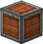
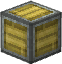
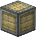
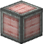
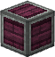
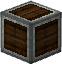

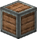
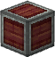
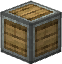
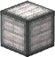
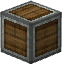
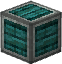

## Storage Controller

- Serves as the central input/output hub for a storage network
- Connects to **Simple Storage Boxes** using **Storage Trim**
- Indicator light illuminates once linked to at least one **Simple Storage Box**
- Supports both manual interaction and automation (e.g. hoppers, chutes, funnels)

## Storage Interface

- Similar to the **Storage Controller** except:
    - Cannot be used directly by players for inserting or extracting items
    - Does not initiate or form a storage network on its own (requires a **Storage Controller**)
    - Designed exclusively for automated input/output (e.g. hoppers, chutes, funnels)

### Storage Interface (Filtered)

- Similar to the **Storage Interface** except:
  - Has a built-in Create filter slot
  - Useful for filtering items when working with vanilla components or mixed automation setups

---

# Backpacks

### Description

Backpacks are wearable storage items that come in several material variants—each offering different storage capacities
and upgrade slots. Designed to integrate seamlessly with automation systems, backpacks feature multiple compartments,
including a main inventory for bulk items, a tool compartment for valuable gear, and dedicated upgrade slots. With
modular upgrades like magnetism, item refill, feeding, tool swapping, and even flight, backpacks offer utility far
beyond basic item storage, making them versatile companions for adventuring, building, or automation-focused gameplay.

## Backpack

- Industrial Iron, Andesite, Copper, Brass, and Hardened Backpacks
- Each backpack can hold up to six upgrades which affect how the backpack works when worn
- Different variations of the backpack stores different amounts of items per slot
- Storage is divided into 3 storage compartments:
    - **Main Storage:** Primary storage area where items can be interacted with by hoppers, chutes, funnels, etc.
    - **Tool Storage:** Secure compartment for your tools or precious items (cannot be interacted with by automation)
    - **Upgrade Slots:** Stores backpack upgrades; enable/disable with [Ctrl] + Right-Click

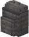
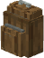
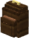
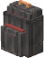
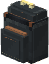

## Backpack Upgrades

Upgrades add new abilities to a backpack. They are crafted from an **Upgrade Template** and installed in the
backpack's six upgrade slots, so any six can be combined at once.

- Most upgrades work while the backpack is worn. The **Magnet**, **Void**, **Jukebox** and **Portable Workshop** upgrades
  also work from a placed backpack
- [Ctrl] + Right-Click an installed upgrade to turn it on or off without removing it
- Upgrades with settings or filters add a tab to the side of the backpack GUI to configure them
- Modpacks can disable any upgrade with the `fxntstorage:disabled_backpack_upgrades` item tag

<b>Show upgrades</b>

| Item                                                                                     | Name                          | Description                                                                                                                                                                |
|------------------------------------------------------------------------------------------|-------------------------------|----------------------------------------------------------------------------------------------------------------------------------------------------------------------------|
|                | **Magnet Upgrade**            | Pulls items into the backpack's main storage compartment from up to 5 blocks away                                                                                          |
|        | **Item Pickup Upgrade**       | Transfers items directly into backpack's main storage instead of player inventory                                                                                          | 
|          | **Pick Block Upgrade**        | Pick block items directly from your backpack                                                                                                                               |
|                | **Refill Upgrade**            | Refills the player's main/off-hand item from the backpack if they are available                                                                                            |
|            | **Tool Swap Upgrade**         | Swaps out any tool held in the player's main hand for the best available tool or weapon when mining a block or attacking an entity                                         |
|                | **Feeder Upgrade**            | Automatically feeds the player food from the backpack when the player is hungry enough to eat                                                                              |
|                | **Thirst Upgrade**            | Automatically gives the player a drink from the backpack when thirsty (requires [Thirst Was Reclaimed](https://www.curseforge.com/minecraft/mc-mods/thirst-was-reclaimed)) |
|                | **Jetpack Upgrade**           | Turns any Backpack into a jetpack with hovering abilities (uses Create backtanks for fuel)                                                                                 |
|              | **Fall Damage Upgrade**       | Prevents the player from taking fall damage while wearing the backpack                                                                                                     |
|          | **Ore Mining Upgrade**        | Mines entire clusters of matching ore blocks, dropping the loot near the player                                                                                            |
|  | **Torch Deployer Upgrade**    | Automatically places a torch from the backpack when the surrounding light level is low                                                                                     |
|              | **Jukebox Upgrade**           | Plays music from the music disc slot in the backpack, providing buffs and ambiance                                                                                         |
|                | **Mechanical Heart Upgrade**  | Grants additional hearts to the backpack wearer (configurable)                                                                                                             |
|            | **Crafting Upgrade**          | Adds a full crafting grid to the backpack, using ingredients from the backpack or the player inventory                                                                     |
|            | **Portable Workshop Upgrade** | A built-in Deployer and Mechanical Press for deploying, pressing and polishing on the go (powered by a backtank)                                                           |
| 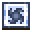                   | **Void Upgrade**              | Voids (deletes) any item matching its filter as it enters the backpack's main storage compartment                                                                          |

### Jetpack Modifiers

The **Jetpack Upgrade** panel in the backpack GUI has a modifier slot. Placing one of the items below in the slot
changes how the jetpack flies, trading off height, speed and fuel. Only one modifier can be used at a time.

| Item                                                                                               | Name                   | Effect                                                                                             |
|----------------------------------------------------------------------------------------------------|------------------------|----------------------------------------------------------------------------------------------------|
| 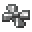                   | **Propeller**          | Raises the height limit from 32 blocks to 64 blocks                                                |
| 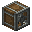               | **Encased Fan**        | Removes the height limit, but uses 10% more fuel for every 16 blocks above 64                      |
|              | **Blaze Burner**       | Afterburner: flies 50% faster with fire exhaust and uses 75% more fuel, setting nearby mobs alight |
| 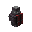 | **Netherite Backtank** | Increases the capacity of all backtanks in the backpack by 50%                                     |
|                | **Fluid Valve**        | Uses 30% less fuel, but flies 10% slower                                                           |
|        | **Firework Rocket**    | Elytra Boost: hold Jump while gliding with an Elytra to fly 50% faster, using 200% more fuel       |

Servers can turn the modifier system off with the `jetpackModifiersEnabled` server config option.

---

# Passer Blocks

### Description

**Passer Blocks** are utility blocks that are used to transfer items between adjacent containers. They operate in a similar
way to hoppers, moving one item at a time, however they do not have any internal inventory. **Smart Passer** blocks expand
on the Passer, by enabling items to be filtered and transferring up to 64 items at once.

## Basic Passer

- Moves items directly between containers, including vanilla storage blocks
- Transfers items in the direction it faces (can be rotated with a Create Wrench)
- Moves one item at a time, similar to a hopper
- Does not have internal storage - items pass through instantly
- Can be used with a Create **Smart Observer** to emit a redstone pulse when an item passes

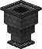

## Smart Passer

- Inherits all the features of the **Passer**, plus:
  - Supports item filtering using a Create filter
  - Transfer amount is configurable via the value panel (click and hold the filter slot to adjust)
  - Will stop item transfer when powered by a redstone signal

---

# Compatibility

| Mod                          | Support                                                   |
|------------------------------|-----------------------------------------------------------|
| **Create**                   | Required — deep integration throughout                    |
| **JEI / EMI / REI**          | Recipe transfer from backpack inventory                   |
| **Jade**                     | Custom tooltips for Simple Storage Boxes and Backpacks    |
| **Curios**                   | Backpack back-slot support                                |
| **Vanilla Backport**         | Pale Oak and Poplar Simple Storage Boxes and Trims        |
| **Every Compat (Wood Good)** | Modded wood types for Simple Storage Boxes and Trims      |
| **Construction Wand/Sticks** | Backpack and Storage Box block placement support          |
| **Create Aeronautics**       | Full support for all components on assembled contraptions |
| **Thirst Was Reclaimed**     | Thirst upgrade for backpack filtering on items and purity |

---

# Modpack Developers

Create: Storage can be tailored to your modpack without writing any code. The
[wiki](https://github.com/ausmez/create-storage-neo-forge/wiki) has references for everything that can be changed:

| Page                                                                                                     | Type          | What you can do                                                                                                   |
|----------------------------------------------------------------------------------------------------------|---------------|-------------------------------------------------------------------------------------------------------------------|
| [Customization Guide](https://github.com/ausmez/create-storage-neo-forge/wiki/Customization)             | Overview      | Start here: which kind of pack changes what, with a quick "I want to…" index                                      |
| [Tags](https://github.com/ausmez/create-storage-neo-forge/wiki/Datapack-Tags)                            | Datapack      | Disable backpack upgrades, add modded ores to Ore Mining, blacklist items from Refill, extend storage networks    |
| [Jukebox Buffs](https://github.com/ausmez/create-storage-neo-forge/wiki/Datapack-Jukebox-Buffs)          | Datapack      | Change the buffs each music disc gives, or add buffs to discs from other mods                                     |
| [Backpack Models](https://github.com/ausmez/create-storage-neo-forge/wiki/Resource-Pack-Backpack-Models) | Resource pack | Retexture or reshape the backpacks, and move or remove the Portable Workshop flywheels                            |
| [Config Reference](https://github.com/ausmez/create-storage-neo-forge/wiki/Config-Reference)             | Config files  | Every server and client option, e.g. magnet range, extra hearts, network range, and turning off Jetpack Modifiers |

Tags can also be changed from a KubeJS server script. To ship your own server defaults, put a copy of
`fxntstorage-server.toml` in your pack's `defaultconfigs/` folder.
